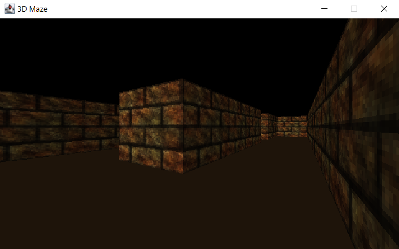

This is a 3D maze that generates a random maze with Eller's Algorithm. The 3D is built by Java ray-casting which display 3D by shooting 2D arrays from the position of the player.

### How To Play
The starting point is at the top left of the map and the goal is at the bottom right. The player can move by w, a, s, d, up, left, right, or down direction keys. The camera can be rotated by drugging with the mouse. The game will terminate if the player reaches the goal.

[GitHub Link](https://github.com/allenLQVE/3DMaze)