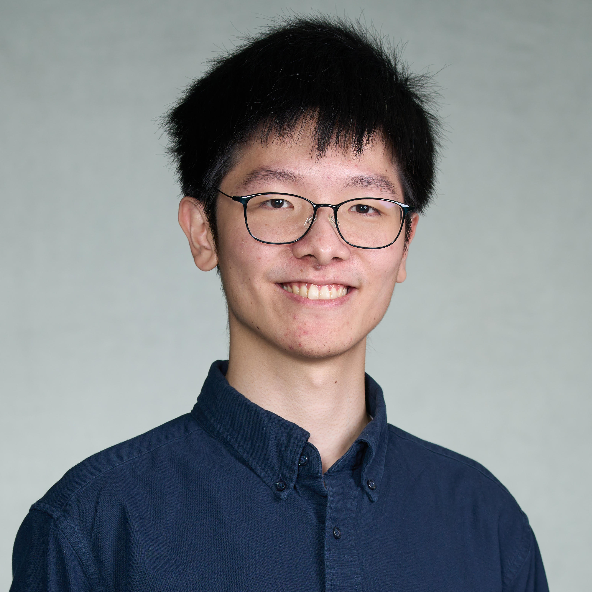

Hi! I am HungHsu Chen, and I also go by Allen. I am passionate about coding, bouldering, and gaming (on both board games and video games!). I am a student at Boston University and am working on my Master of Science in Computer Science. I am aiming to become a software developer.

I had my undergrad at the University of California, Davis. My majors were Statistics and Japanese. I became interested in the Japanese language and culture after I went to Japan to study abroad, and Statistics was a "major for getting a job." After I graduated, I looked for a job in data science but didn't go well. Nevertheless, with the SQL and Python that I self-learned while looking for a job, I was able to get an offer from a consultant company, and finally connect to a contract position at Microsoft. Where at Microsoft, I learned about cloud computing and experienced working as a software engineer.

After I went back to Taiwan, I was able to get a position at Willingbikes as a Management Information System executive. This job gave me a lot of experience in software development. As my responsibility, I not only needed to fix technical issues but also to develop the application used within the company. The application we developed was based on an ERP system. As the system was purchased years ago, our goal was to develop new functions to meet the needs of different departments. The application was developed by PHP with Laravel framework, and the server was hosted on a VM in our private network. In this position, I was able to learn how to build a web application with MVC, and this experience evoked my interest in software development.

With a strong interest in software development, I applied to the MSCS at Boston University. Here, I have studied programming with Java, styles of coding, algorithms, operating systems, software design patterns, etc. Now, my goal is to get a position as a software developer which can let me apply what I learned and let me write code that I love.